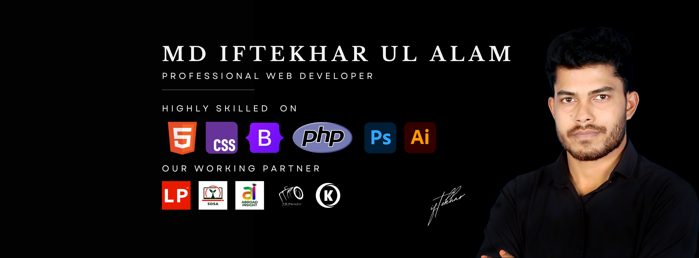
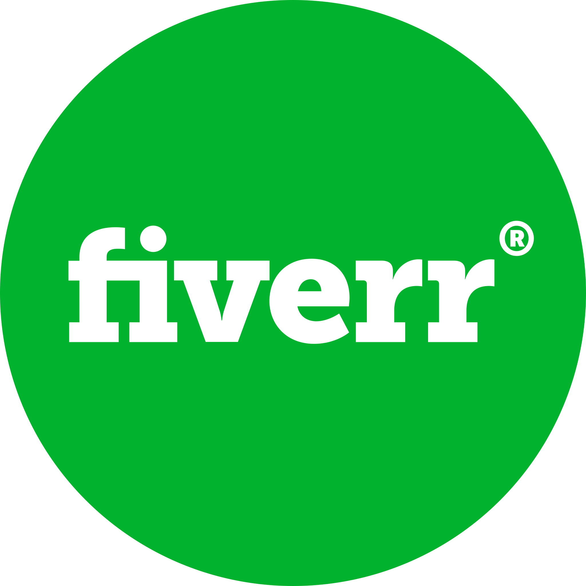

<!-- Dark-Themed README.md for GitHub -->

<h1>Hello, I'm MD. IFTEKHAR - UL - ALAM</h1>
<h3>A passionate fullstake developer from Bangladesh 🇧🇩</h3>

  

  

🔭 I’m currently working at <a href="https://freedomitinstitutions.com/" style="color:#58a6ff;">Freedom IT Institution</a>

---

<h3>🌐 Connect with me</h3>

<!-- Start Hire me these icons are downloaded from "https://worldvectorlogo.com/downloaded/youtube-icon-5" as svg file -->

<!-- Stop Hire me -->

<h3>💻 Tech Stack</h3>

  

---

<h3>📊 GitHub Stats</h3>

  
  

  

---

<h3>🚀 Featured Projects</h3>

<ul align="left">
  <li><strong>🏆 Project 1:</strong> <a href="https://github.com/iftekharulalam/project-1" style="color:#58a6ff;">E-commerce Frontend</a> – Built with React, Redux, Tailwind</li>
  <li><strong>🧠 Project 2:</strong> <a href="https://github.com/iftekharulalam/project-2" style="color:#58a6ff;">Student Management System</a> – PHP + MySQL + Admin Dashboard</li>
</ul>

---

<h3>📫 Let’s Build Together!</h3>

If you’re hiring, collaborating, or just want to chat tech—feel free to <a href="mailto:iftekhar@example.com" style="color:#58a6ff;">reach out</a>!

🌱 *"Code is not just code, it's a craft we keep refining every day."*

